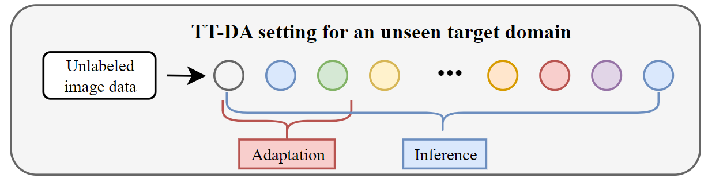

#  MABN (AAAI2024)
This repo contains official implementation of our paper: Test-Time Domain Adaptation by Learning Domain-Aware Batch Normalization

***(Code coming soon)***

## Background
We focus on the problem of *Test-time Domain Adaptation (TTDA)* or *Few-shot TTDA*. When an unseen target domain is encountered at test-time, a few unlabeled images are sampled to update the model towards that domain. The adapted model is then used for testing the data in that domain. 

<div align="center">

</div>

## Method overview

<div align="center">

</div>

## :star: Acknowledgement

Our code is built upon the codebase from [MetaDMoE (NeurIPS22)](https://github.com/n3il666/Meta-DMoE)


## <a name="cite"/> :clipboard: Citation

If you use this code in your research, please consider citing our paper:
```
@InProceedings{wu2024MABN,
               title={Test-Time Domain Adaptation by Learning Domain-Aware Batch Normalization},
               author={Yanan Wu, Zhixiang Chi, Yang Wang, Konstantinos N. Plataniotis, Songhe Feng},
               booktitle={AAAI Conference on Artificial Intelligence},
               year={2024}}
```
